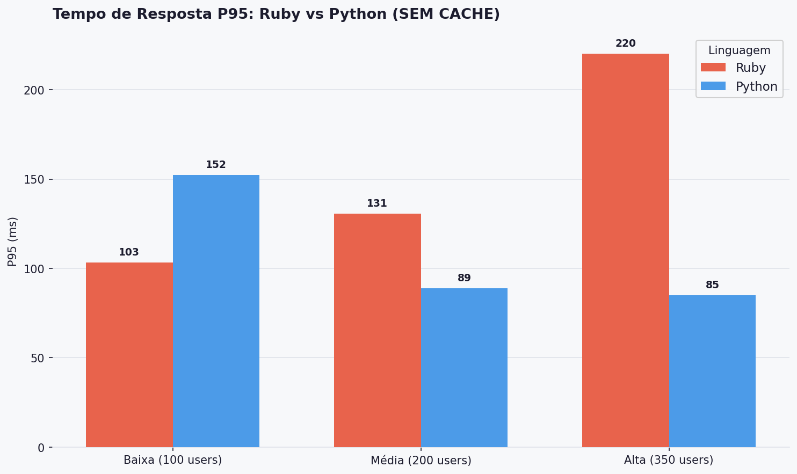
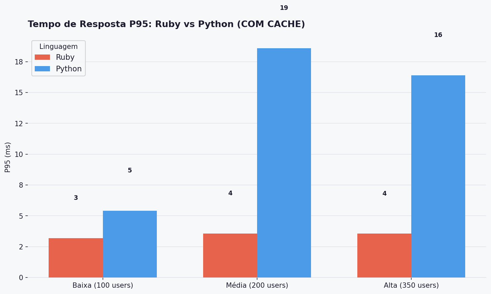
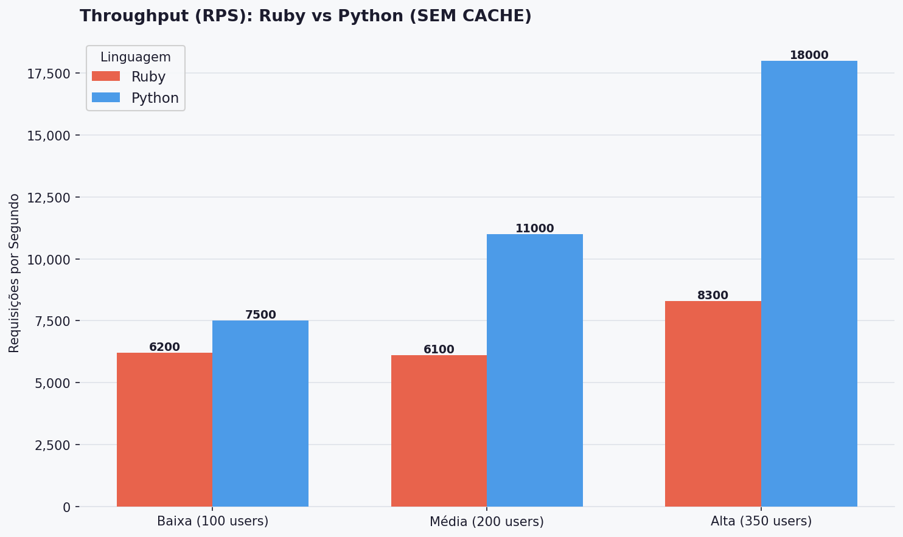
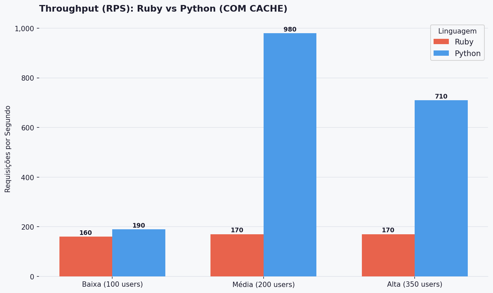
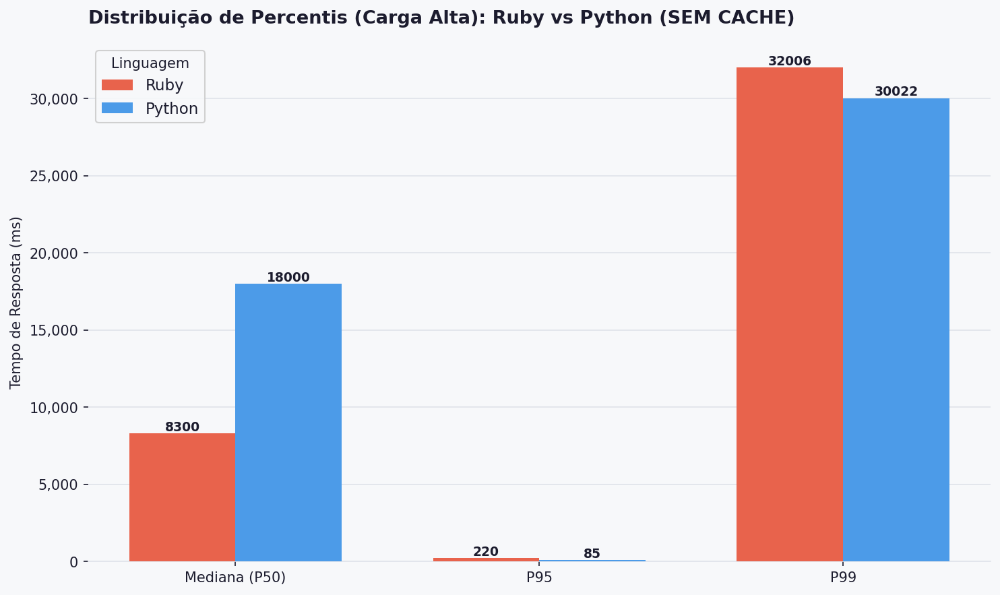
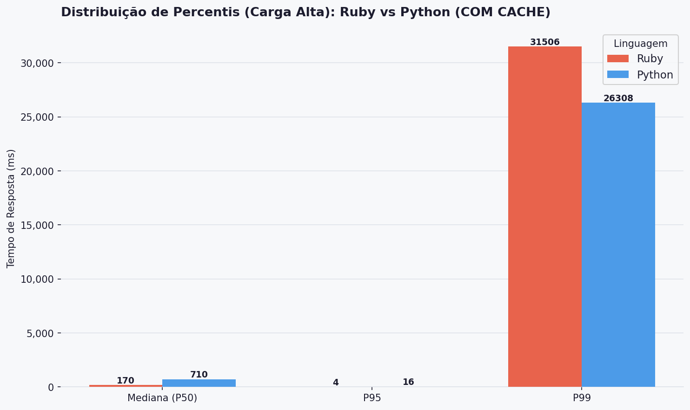

# Análise de Desempenho e Escalabilidade: Ruby vs Python

Este repositório contém o laboratório de testes de desempenho desenvolvido para avaliar e comparar o comportamento de duas implementações de uma mesma API (Link Extractor) desenvolvidas em **Ruby (Sinatra)** e **Python (Flask)**. 

Este estudo prático simula cenários de estresse e concorrência para embasar decisões arquiteturais, avaliando as linguagens lidando diretamente com processamento e I/O de rede (Sem Cache) e mensurando o impacto da introdução de uma camada de **Redis** (Com Cache).

## 🛠 Tecnologias e Infraestrutura
* **Linguagens/Frameworks:** Python 3.11 (Flask) e Ruby 3.3 (Sinatra).
* **Armazenamento:** Redis (como banco de dados em memória para cache).
* **Testes de Estresse:** Locust (ferramenta baseada em eventos para injeção de carga).
* **Orquestração:** Docker e Docker Compose (garantindo o isolamento exato dos recursos em contêineres).

## 📊 Metodologia de Teste
A API foi bombardeada com chamadas concorrentes para extrair links de 10 URLs diferentes. Os testes foram divididos em 3 níveis de carga progressiva (com ramp-up de 5 usuários/segundo e duração de 2 minutos por teste):
1. **Baixa Carga:** 100 usuários simultâneos.
2. **Média Carga:** 200 usuários simultâneos.
3. **Alta Carga:** 350 usuários simultâneos.

---

## 📈 Análise dos Gráficos e Resultados

Abaixo está a quebra detalhada do comportamento das duas linguagens sob estresse, baseada nos dados consolidados das execuções do Locust.

### 1. Tempo de Resposta P95 (Sem Cache)

**Análise:** O percentil 95 (P95) indica que 95% das requisições foram resolvidas neste tempo ou menos. 
* Em carga **baixa**, o Ruby é ligeiramente mais rápido (103ms contra 152ms do Python).
* No entanto, conforme a concorrência aumenta para **média e alta**, o Ruby apresenta uma degradação de performance, chegando a um P95 de 220ms. O Python se mostrou mais estável e otimizado para lidar com conexões HTTP concorrentes massivas direto na fonte, caindo para consistentes 85ms~89ms.

### 2. Tempo de Resposta P95 (Com Cache)

**Análise:** A introdução do Redis muda completamente o cenário, transformando um gargalo de processamento em um cenário de alta velocidade de leitura em memória.
* Ambas as linguagens apresentam tempos excelentes (abaixo de 20ms).
* Sob esta arquitetura otimizada, o **Ruby brilha de forma absoluta**. Ele mantém o P95 praticamente inalterado em impressionantes **3 a 4 milissegundos**, não importando o nível de carga imposto. O Python, embora rápido, sofre uma leve flutuação, estabilizando na faixa dos 16ms a 19ms em cargas mais altas.

### 3. Throughput / RPS (Sem Cache)

**Análise:** O Throughput mede a vazão total, ou seja, quantas requisições por segundo (RPS) o servidor conseguiu engolir e devolver.
* Fica evidente que o **Python (Flask)** possui uma capacidade maior de enfileiramento e processamento assíncrono nativo sob o capô nesse cenário. Na carga máxima (350 usuários), o Python alcança um pico de **18.000 RPS**, enquanto o Ruby (Sinatra) consegue processar cerca de **8.300 RPS**. 

### 4. Throughput / RPS (Com Cache)

**Análise:** Com as respostas cacheadas, o esforço do servidor muda de "buscar na internet e fazer parsing de HTML" para "ler do Redis e devolver JSON".
* Embora os números de RPS registrados variem devido à velocidade com que as requisições fluem pela rede, o Python continua mantendo picos de vazão registrados mais altos na carga média (980 RPS contra 170 do Ruby), mostrando agilidade na ponte Flask-Redis.

### 5 e 6. Distribuição Extrema de Percentis (Carga Alta)

**Sem Cache**

**Com Cache**

**Análise:** O percentil 99 (P99) costuma revelar os piores cenários (caudas longas e timeouts). 
* Olhando a **Mediana (P50) sem cache**, vemos números extremamente altos (8.300ms para Ruby e 18.000ms para Python), o que indica que requisições mais pesadas ficam presas na fila aguardando I/O. O P99 nas duas linguagens encosta na marca dos 30.000ms, que é o limite de timeout configurado no teste.
* Ao analisar os **percentis com cache**, o problema desaparece. A mediana de tempo de resposta global despenca para apenas **170ms no Ruby e 710ms no Python**. Isso prova o conceito arquitetural central do experimento: um sistema não deve confiar apenas no poder da linguagem; a aplicação de cache é o principal pilar para garantir disponibilidade e prevenir estrangulamento da aplicação sob estresse.

---

## 🎯 Conclusão

1. **Quando o processamento é pesado e dependente de I/O externo (Sem Cache):** Python lidou melhor com o volume massivo, entregando tempos no P95 muito mais curtos e mantendo um Throughput (RPS) significativamente mais alto.
2. **Quando a arquitetura conta com banco em memória (Com Cache):** Ruby apresentou uma integração e velocidade de entrega formidáveis, entregando 95% das respostas em meros **4 milissegundos**, superando o Python na consistência fina do tempo de resposta.
3. **Fator Arquitetural:** Independentemente da linguagem (Python ou Ruby), a introdução do Redis provou ser a mudança de maior impacto, reduzindo os tempos de resposta de forma drástica e erradicando gargalos mortais de fila.